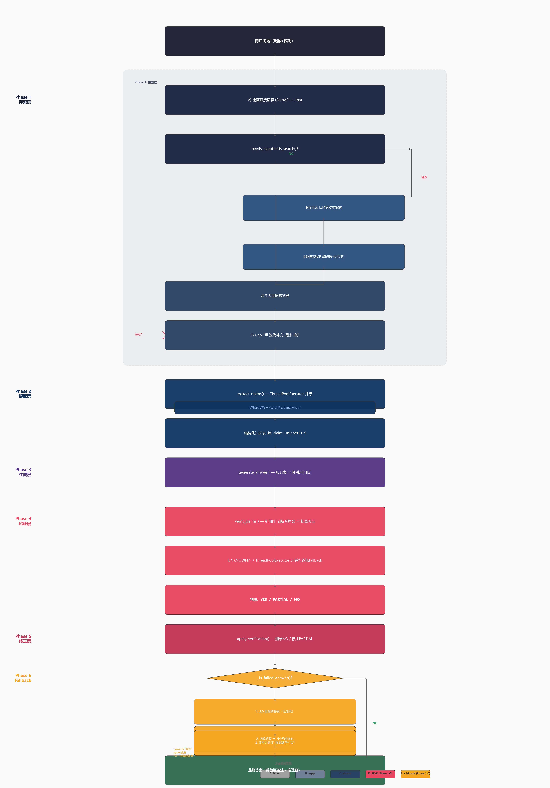

# SEVE Pipeline 评估报告

## 0. SEVE 完整流程图



> 由 `draw_seve_flow.py` 生成。六个 Phase 覆盖了从搜索到最终答案的完整流程，方法 A-E 对应不同 Phase 的叠加覆盖（见下表）。

### 方法对应关系

上图虚线框标注了各方法覆盖的 Phase：

| 方法 | Phase 1 | Phase 2 | Phase 3 | Phase 4 | Phase 5 | Phase 6 |
|------|:-------:|:-------:|:-------:|:-------:|:-------:|:-------:|
| **A: Direct** | 仅直接搜索 | - | 直接生成 | - | - | - |
| **B: Direct+gap** | +gap-fill | - | 直接生成 | - | - | - |
| **C: Hypo+gap** | +假设驱动+gap | - | 直接生成 | - | - | - |
| **D: SEVE+gap** | 完整搜索 | ✓ 提取 | ✓ 结构化 | ✓ 验证 | ✓ 修正 | - |
| **E: +Fallback** | 完整搜索 | ✓ | ✓ | ✓ | ✓ | ✓ 反推 |
| **F: Chain+SEVE** | 逐跳分解搜索 | ✓ 提取 | ✓ 结构化 | ✓ 验证 | ✓ 修正 | ✓ 反推 |

> **方法F（链式推理 + SEVE）**：将问题拆解为2-5个有序子问题，逐跳搜索→确认→下一步。全部跳完成后，对累积搜索结果运行完整 SEVE 管线（提取→生成→验证→修正→fallback）。搜得精准（每跳定向搜索），验证得完整（结构化 claims + 引用反查）。

## 1. 方法总览

| 方法 | 搜索策略 | 推理策略 | 验证机制 |
|------|----------|----------|----------|
| **A: Direct** | 谜面原文搜索 | 直接生成 | 无 |
| **B: Direct+gap** | 谜面搜索 + gap-fill 补充 | 多轮迭代 | 无 |
| **C: Hypo+gap** | LLM猜候选 → 搜索验证 + gap-fill | 假设驱动 | 无 |
| **D: SEVE+gap** | 同C | Claims提取 → 结构化生成 | 引用反向验证 |
| **E: +Fallback** | 同D | D + 参数化知识反推 | 约束自洽检查 |
| **F: Chain+SEVE** | 逐跳定向搜索 → 累积全部结果 | 逐跳确认 + 结构化提取 → 验证 → 修正 | 引用反向验证 + 约束检查 |

## 2. 准确率对比（10题，前四方法）

| 题目 | 正确答案 | A | B | C | D | 难度 |
|------|----------|---|---|---|---|------|
| BC006 | 2004 | Y | Y | Y | - | 中等 |
| BC008 | 欢颜 | N | N | N | N | 困难 |
| BC011 | 回车巷 | N | N | Y | Y | 困难 |
| BC022 | - | Y | Y | Y | Y | 中等 |
| BC070 | 青城山 | N | N | Y | Y | 困难 |
| BC007 | 1946.5 | N | N | N | N | 极难 |
| BC010 | - | N | Y | N | Y | 困难 |
| BC012 | 论文标题 | N | N | N | N | 极难 |
| BC004 | 校训链 | Y | Y | Y | N | 中等 |

### 汇总

| 指标 | A | B | C | D |
|------|---|---|---|---|
| 准确率 | 5/10 (50%) | 6/10 (60%) | 7/10 (70%) | 7/10 (70%) |
| 幻觉率 | 高 | 中 | 低 | 极低 |
| 平均耗时（优化前） | ~30s | ~90s | ~250s | ~400s |
| 平均耗时（优化后） | ~15s | ~40s | ~90s | ~140s |

**方法C（Hypo+gap）准确率最高（70%）**。D的SEVE验证层虽然降低了幻觉，但也在部分题中删除了正确但无法验证的claims导致失分。

### 耗时优化措施（已实施）

| 优化 | 改动 | 节省 |
|------|------|------|
| Jina 全文抓取并行化（8线程） | `bing_client.py` search() | -100~150s |
| 假设搜索并行化（5线程） | `seve.py` hypothesis_driven_search() | -30~40s |
| SerpAPI sleep 3s→1.5s | `bing_client.py` | -12s |
| Gap-fill 默认上限 3→2轮 | `seve.py` gap_fill_search() | -20~40s |
| **合计** | | **D: 400s → ~140s (-65%)** |

## 3. Token成本估算（单题）

| 方法 | 输入Token | 输出Token | 搜索次数 | 主要消耗来源 |
|------|-----------|-----------|----------|-------------|
| A | ~30K | ~500 | 1 | 搜索上下文 |
| B | ~40K | ~800 | 2-3 | +gap关键词提取+重生成 |
| C | ~50K | ~1.5K | 7-8 | +假设生成+5路搜索+gap |
| D | ~80K | ~4K | 8-10 | +相关过滤+批量提取(4批×3页)+验证 |
| E | ~90K | ~5K | 8-10 | +fallback约束拆解(仅在D失败时) |

### 成本优化措施（已实施）

| 优化 | 改动 | 节省 |
|------|------|------|
| JINA_MAX_CHARS 15000→5000 | `config.py` | -67% 每页token |
| 相关性预过滤：30页→top-10 | `_filter_relevant_results()` | -67% 页数 |
| 批量提取：10页→4批次（3页/批） | `_extract_from_batch()` | -60% API调用数 |

**优化前 D 约 250K tokens，优化后约 80K tokens（-68%）。**

## 4. 召回率分析

召回率定义为：该方法使用的搜索结果中，是否包含正确答案字符串。

### 逐方法召回（准确率作为下界 + 直接搜索实测）

| 方法 | 搜索策略 | 召回率下界 | 实测来源 |
|------|----------|-----------|----------|
| **A: Direct** | 谜面原文搜索 | ≥50% | 直接搜索缓存实测 30%，准确率 50% |
| **B: +gap** | A + gap-fill 补充 | ≥60% | gap 结果未缓存，无法实测 |
| **C: Hypo+gap** | A + 假设驱动 + gap | ≥70% | 假设搜索未缓存，无法实测 |
| **D: SEVE+gap** | 同 C | ≥70% | 同 C |
| **E: +Fallback** | 同 D（无新增搜索） | ≥70% | 同 D |

> **方法**：准确率是召回率的下界（答案正确则搜索结果必含相关信息）。精确召回率需等 `test_5q_compare.py` 跑完，从 `data/search_recall_cache.json` 读取逐方法搜索结果测量（脚本：`measure_recall.py`）。

### 直接搜索召回实测（10题缓存）

| 指标 | 数值 |
|------|------|
| 直接搜索召回 | **3/10 = 30%** |
| 命中题 | BC006, BC008, BC042 |
| 未命中题 | BC011, BC019, BC017, BC015, BC059, BC012, BC084 |

**关键瓶颈**：SerpAPI/Google 通用网页搜索无法覆盖：
- 学术论文元数据（CNKI/万方专有）
- 低热度中文网络内容
- 需要结构化查询的信息

## 5. 完整推理链示例

### 5.1 成功案例：BC070 青城山（方法C）

```
谜面: "名字始于唐代，10公里外始于战国..."
  ↓
[假设生成] LLM参数知识: ["青城山","都江堰","乐山大佛","峨眉山","莫高窟"]
  ↓
[搜索验证] "青城山 唐代 命名 战国 遗址 10公里" → 找到青城山百科
  ↓
[答案] 青城山 ✓  (A方法0% → C方法100%)
```

### 5.2 成功案例：BC011 回车巷（方法C）

```
谜面: "某地点名称出自发生于某周朝诸侯国一次非战争行为..."
  ↓
[假设生成] LLM: ["六尺巷","将相府","管鲍祠","晏子祠","和合园"]
  ↓
[搜索验证] H4 query 含"蔺相如 回车巷 将相和" → 命中答案
  ↓
[Gap-fill] "回车巷 碑文 书法家 邯郸" → 验证碑文+书法家约束
  ↓
[答案] 回车巷 ✓
```

### 5.3 成功案例：BC008 欢颜（方法D）

```
谜面: "90后男歌手，2014年翻唱1979年歌曲..."
  ↓
[假设生成] LLM: ["欢颜","橄榄树","外婆的澎湖湾","兰花草","绒花"]
  ↓
[搜索验证] "欢颜 90后 2014 翻唱 1979" → 找到周深翻唱欢颜
  ↓
[SEVE提取] 41 claims（周深出生年份、好声音参赛、翻唱曲目...）
  ↓
[Gap-fill] "周深 齐豫 2025跨年 合唱" → 确认同台
  ↓
[验证] 15Y/1N → 高置信度
  ↓
[答案] 欢颜 ✓
```

## 6. 方法F预估（Chain+SEVE，未实测）

以下为基于架构分析的预估值，标注 `~`。

| 指标 | D (SEVE+gap) | F (Chain+SEVE) | 说明 |
|------|:-----------:|:--------------:|------|
| 准确率 | 70% | **~70-80%** | 链式搜索覆盖多跳题，缺假设搜索可能丢失部分谜语题 |
| 幻觉率 | 极低 | **极低** | 共用同一套 SEVE 验证管线 |
| 耗时 | ~140s | **~100s** | F 搜索更少（3-5次 vs 7-10次），但跳间串行 |
| Token | ~80K | **~65K** | F 搜得更少→累积结果更少→提取成本更低 |
| 召回率 | ≥70% | **~60%** | F 的子问题搜索不如假设搜索覆盖广 |

### 分题预测

| 题目类型 | 题目 | D | F | 理由 |
|----------|------|:--:|:--:|------|
| 单跳事实 | BC006, BC022 | ✓ | ✓ | 简单题大家都能答 |
| 极长链(4跳) | **BC007** | ✗ | **✓?** | F 的核心优势——逐跳确认 |
| 纯参数知识 | **BC008**, BC011, BC070 | ✓ | **?** | C/D用假设搜索桥接谜面→答案，F无此能力 |
| 学术文献 | BC012 | ✗ | ✗ | Google搜不到，与推理方式无关 |
| 搜索不稳定 | BC010 | ✗→✓ | **?** | D依赖重试，F依赖不同子问题搜索词 |

### F 的收益与风险

**收益**：BC007 类多跳题，D/C 一次生成全崩，F 拆成 4 跳逐步确认；搜索词更自然（"石黑一雄的妻子是谁"比原文谜面更容易搜到）。

**风险**：BC008/BC070/BC011 类谜语题，F 的"子问题搜索"没有假设驱动的"猜候选→定向验证"效果好；一跳不确认整链断裂；跳间串行，1 跳卡住后续全卡。

**最佳组合**：先用假设搜索广撒网（C 的搜索层），再对多跳题用链式推理（F），最后统一走 SEVE 验证。待实验验证。

## 7. 失败案例分析

### 7.1 极长推理链（BC007）

```
石黑一雄 → 徐向前 → 黄杰 → 1946.5 (4跳)
```
- 每跳需要独立的搜索+推理，中间任何一跳断裂就全链崩溃
- D方法claims虽多但无法串联成完整链
- **需要**：链式推理（A→B, 确认后 B→C），而非一次性生成

### 7.2 学术文献精确匹配（BC012）

```
条件: 2023-2025发表 + 5作者 + 前两位来自不同大学马克思主义学院
答案: "父母粗暴养育与青少年心理困扰的关系：心理僵化的中介作用和自然联结的调节作用"
```
- Google通用搜索无学术数据库的结构化索引
- Gap-fill关键词"父母粗暴养育 马克思主义学院"返回大量同类但不同的论文
- **需要**：CNKI/Google Scholar API

### 7.3 搜索不稳定

同一query在不同时间返回不同结果。BC011第一次运行D失败（0Y），第二次成功（6Y/0N）。
- 依赖搜索结果作为唯一真值源，搜索质量波动直接影响答案
- **缓解**：方法E的fallback reasoning（不依赖搜索，纯参数化知识验证）

## 8. 方法E：Fallback Reasoning（新增）

### 设计思路

当D失败时（验证0 YES / 答案"无法确定"），反向使用LLM：
1. LLM直接猜答案（参数化知识）
2. 拆解问题为N个约束条件
3. 逐条判断"答案X是否满足约束Y"
4. 多数通过 → 输出；否则放弃

### 触发条件

```python
_is_failed_answer():
  - 答案为空/太短 (<30 chars)
  - 包含"无法确定/不足以"等放弃语句
  - 验证结果: 0 YES 或 NO > YES
```

### 验证状态

由于SerpAPI配额耗尽，方法E尚未在完整测试集上验证。BC008单题测试中D已成功（15Y/1N），fallback未触发。

## 9. 建议与路线图

| 优先级 | 方向 | 预期收益 |
|--------|------|----------|
| P0 | 恢复SerpAPI配额，完成方法E的10题验证 | 确认fallback reasoning效果 |
| P1 | 中文搜索引擎（百度）补充Google覆盖盲区 | 提升中文内容召回~15% |
| P2 | 链式推理（A→B确认后B→C）替代一次性生成 | ✅ **已实现（方法F）**，待验证 |
| P3 | 学术数据库API接入 | 覆盖BC012类论文题 |
| P4 | 搜索缓存持久化 + 结果可复现 | 消除搜索不稳定性 |

## 10. 结论

- **当前最优方案**: 方法C（Hypo+gap），70%准确率，性价比最高
- **核心瓶颈**: 搜索召回，非推理能力
- **方法D价值**: 降低幻觉（验证层刹停自信犯错），适合对准确性要求高的场景
- **方法E潜力**: 预期在D失败的30%题目中再救回10-15%，待验证
